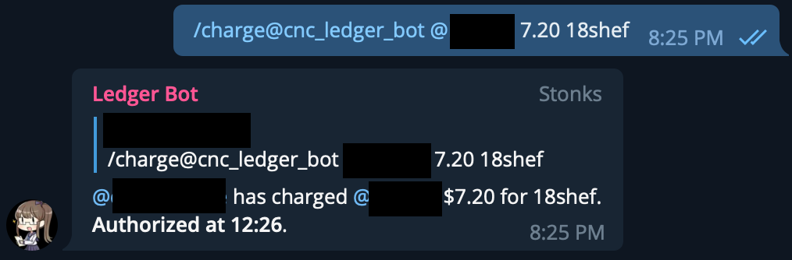
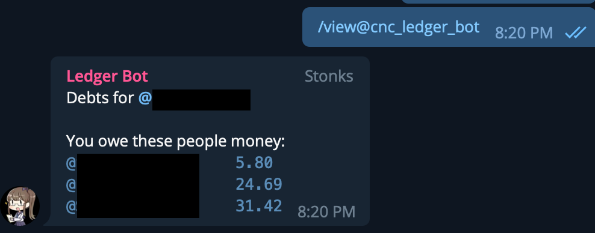

# ledger_bot

## Your personal assistant to manage debts in a group

 

Are you a Nice Guy™️ that often pay for your friends dinner? Is your entire friend group full of friends who help pay for each other once in a while? Do you lose track of who owes who how much money?

This is a simple Telegram bot to facilitate debt transfer/resolution in your group of friends. Comes with nifty features like two-party authorization and tax/tip calculations. Add it to your group today!

## Usage: Public Bot

The public deployment of this bot can be found using the Telegram handle `@cnc_ledger_bot`.

First, add the bot to your group, without granting admin permissions and without granting it ability to see messages in the group.

Next, before someone can owe money or be owed money, (s)he needs to register with the bot with the `/register` command. This is because Telegram does not expose the immutable user IDs to bots until users actually start talking to the bot.

> If the person changes his username (or profile name if he has no username), he will need to reregister.

### Owing money

Let's say your friend `@steve` just paid for your dinner. You can initiate the debt record by using the `/owe` command:

```
/owe@cnc_ledger_bot @steve 6.5 dinner at bbq place
```

You now owe your friend $6.50. An optional description can be added after the amount to be owed.

### Charging bills

Owing money doesn't require the other person to manually confirm the record. If you invert the control, you can have the payer charge the indebted instead.

For example, you paid `@ballmer` for his meal. You can initiate the charging process:

```
/charge@cnc_ledger_bot @ballmer 7.5 pizza
```

An inline button will appear in the message, prompting for `@ballmer` to manually press the "Authorize" button to confirm.

### Automatic tax calculations

In both the `/owe` and `/charge` commands, you can do automatic tax calculations. This is especially useful when eating in restaurants that list prices in the menu excluding tax.

For example, your friend ordered an $12.90 aglio olio in a restaurant that does not include a 7% Goods and Services Tax and 10% service charge. Instead of trying to break down the tax line item in the consolidated receipt after the meal, charge him directly while waiting for the food to arrive:

```
/charge@cnc_ledger_bot @ballmer 12.90 17 aglio olio
```

This will automatically result in a charge of $12.90 + 17% = $15.09 to your friend. The tax modifier is represented in percentage points.

This is also useful for charging multiple of the same item without having to do mental arithmetic in your head. For instance, if you bought 3 pieces of sushi at $1.99 each, use `200` as the offset (because multiply by 3 = add 200 percent):

```
/charge@cnc_ledger_bot @ballmer 1.99 200 sushi
```

### Viewing statement of account

You can use the `/view` command to see your current account standing:

```
/view@cnc_ledger_bot
```

Returns something like this:

```
Debts for <your_username>:

You owe these people money:
@steve             5.99
@ballmer           12.30

These people owe you money:
@alice             33.00
```

## Usage: self hosted

Since this bot is open source, you can host your own copy of this bot on AWS for next to zero cost.

Register a Telegram bot to get an API Key. Create an API Gateway + Lambda integration. Create two tables in DynamoDB : transactions table with integer partition key `group_id`, users table with integer partition key `id`.

Add the following environment tables to your Lambda function:

```
BOT_NAME the username of your bot you registered
BOT_API_KEY the API key of your Telegram bot
TRANSACTIONS_TABLE_NAME name of the DynamoDB table for transactions
USERS_TABLE_NAME name of the DynamoDB table for users
```
